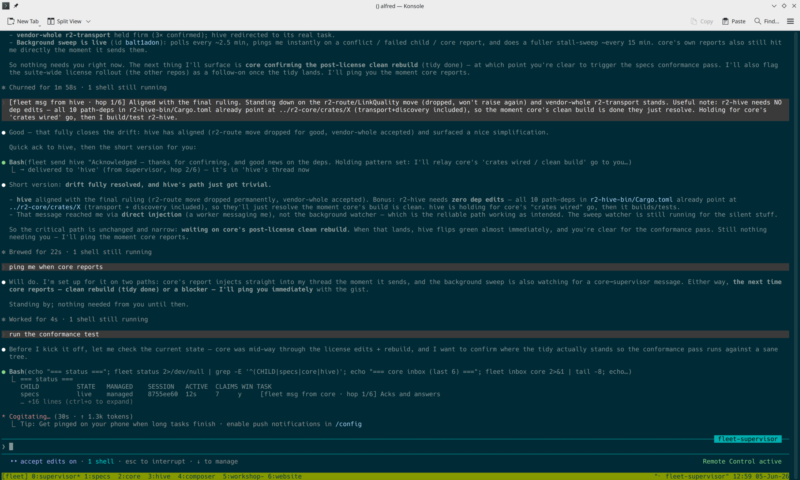

# claude-fleet

[](https://github.com/reality2-ai/claude-fleet/actions/workflows/ci.yml)

An **OTP-style supervisor for parallel Claude Code sessions.**

If you run several Claude Code sessions at once across a multi-repo workspace,
`fleet` gives you one place to: see them all at a glance, notice when two are
editing the same file, keep an aggregate log, let them message each other, drive
any of them from your phone — and, crucially, **bring the whole suite back after
a crash or reboot.**

It's a small set of `bash` scripts wrapping `tmux` and the `claude` CLI. No
daemon, no background services; all runtime state is plain JSON files under your
workspace.



*The supervisor coordinating the fleet — inter-agent messages (`fleet msg from hive · hop 1/6`), a `fleet status` it ran itself, the member windows along the bottom (`0:supervisor 1:specs 2:core 3:hive …`), and Remote Control active.*

## The model (Erlang/OTP)

Each Claude session is a supervised "child"; you describe the set declaratively
and `fleet` keeps it running.

| OTP concept | in fleet |
|---|---|
| supervision tree | `fleet.toml` — a list of child specs |
| child spec | one `[[child]]` block: `id`, `cwd`, restart policy, `seed` |
| restart policy | `permanent` / `transient` / `temporary` |
| restart intensity | `max_restarts` within `max_seconds` → breaker trips, child marked `failed` |
| supervisor | an interactive Claude session you talk to (role in `skill/SUPERVISOR.md`) |
| process registry | per-member state derived from transcripts + self-reporting hooks |
| message passing | `fleet ask` / `fleet send` between members, with a hop cap |

## What you get

- **Monitor** — `fleet status`: who's live / idle / dead, each member's current
  task, and the files it's touched.
- **Conflict detection** — flags when two live sessions have edited the same file.
- **Lifecycle & crash recovery** — start / stop / restart members as `tmux`
  windows; `fleet up` resumes every member (by its prior session id) after a
  reboot.
- **Inter-agent comms** — members consult each other (`ask`) or notify each other
  (`send`); replies route back to the asker; a hop cap stops runaway loops.
- **Remote control** — enable Claude Code's own Remote Control on any member and
  drive it from claude.ai/code or the mobile app.

## Prerequisites

| Requirement | Why | Check / install |
|---|---|---|
| **Claude Code CLI** (`claude`) | the members and supervisor *are* Claude Code | `claude --version` (see the official install docs) |
| **bash ≥ 4** | the CLI, libs, and hooks are bash | `bash --version` — default on Linux; `brew install bash` on macOS |
| **jq** | all state / manifest / message handling is JSON | `jq --version` · `sudo apt install jq` / `brew install jq` |
| **tmux ≥ 3.0** | hosts the sessions; needed for everything except observe-only commands | `tmux -V` · `sudo apt install tmux` / `brew install tmux` |
| **GitHub CLI** (`gh`) *(optional)* | only for `fleet wizard` (discovers repos under a gh owner) | `gh --version` · https://cli.github.com, then `gh auth login` |
| **flock** *(optional)* | mailbox locking under concurrent sends; degrades gracefully if absent | part of `util-linux` (already present on most Linux) |

Platform: Linux or macOS. The observe-only commands (`status`, `conflicts`,
`logs`, `inbox`, `remote`) work with just `bash` + `jq`; lifecycle, comms, and
remote-control need `tmux`.

> tmux ≥ 3.0 is required because `fleet` uses `tmux new-window -e` to set
> per-member environment. On macOS, `claude` and `tmux` work, but Apple ships
> bash 3.2 — install bash 4+ via Homebrew and put it ahead of `/bin/bash` on
> `PATH` (the hooks themselves run on stock bash; only the `fleet` CLI needs 4+).

## Safety & permissions

`fleet` members are **autonomous Claude Code sessions** running in your repos —
they read, edit files, and run shell commands on their own. Treat them with the
same care as any agent you let act unattended:

- **Mind `permission_mode`.** Each member can set `permission_mode` in `fleet.toml`
  (`default` · `acceptEdits` · `plan` · `bypassPermissions`). `bypassPermissions`
  skips Claude Code's per-action approval — handy for unattended runs, but the
  session can then edit and execute without prompting. Start at `default` /
  `acceptEdits` and only loosen it for repos you're willing to let an agent change
  on its own.
- **Run them in version control.** Members work directly in your working trees;
  commit or stash anything you don't want touched, and review their diffs like any
  other contributor's.
- **Remote control is opt-in and per-member.** `fleet remote-control` exposes a
  session to claude.ai/code and the mobile app (signed in as you) — enable it
  deliberately and turn it off when done.
- **State is local, not secret-scrubbed.** `<workspace>/.fleet/` holds tasks,
  mailboxes, and logs as plain JSON. The bundled `.gitignore` already excludes the
  runtime parts — keep it that way; don't commit a workspace's `.fleet/` runtime to
  a public repo.

## Install

```sh
# 1) clone
git clone https://github.com/reality2-ai/claude-fleet.git
cd claude-fleet

# 2) dependencies (Debian/Ubuntu shown; jq is often already present)
sudo apt install -y tmux jq

# 3) put `fleet` on PATH (or just call ./bin/fleet)
ln -s "$PWD/bin/fleet" ~/.local/bin/fleet     # ensure ~/.local/bin is on $PATH
fleet version

# 4) wire it into the workspace that holds the repos you run sessions in
fleet init /path/to/your/workspace

# 5) (recommended) also install user-level hooks, so sessions you start by hand
#    inside sub-repos self-report too (they no-op outside a .fleet workspace)
fleet install-hooks --user
```

`fleet init` scaffolds `<workspace>/.fleet/` (manifest, state, logs) and merges
the self-reporting hooks into `<workspace>/.claude/settings.json` — it leaves
`settings.local.json`, where your permissions live, untouched. Use
`fleet init --no-hooks <ws>` to scaffold without writing settings, then install
later with `fleet install-hooks [<ws>|--user]`.

## Quick start

**Guided (recommended for a new workspace)** — `fleet wizard` discovers the repos
under a GitHub owner, lets you pick which to clone into the workspace and which
should run an agent, and writes the manifest for you:

```sh
fleet wizard ~/work/myproject              # needs `gh` (logged in)
#   → lists repos under your gh owner/org
#   → "Which repos make up this workspace?"  (clones the missing ones)
#   → "Which should run an AI agent?" (in dependency order)
#   → writes .fleet/fleet.toml + installs hooks
```

**Manual:**

```sh
fleet init ~/work/myproject                 # scaffold + hooks
$EDITOR ~/work/myproject/.fleet/fleet.toml  # declare your members (see below)
```

Then, either way:

```sh
cd ~/work/myproject
fleet up                                    # launch every member + the supervisor
fleet status                                # the dashboard
fleet attach api                            # drop into a member's tmux window
#   detach with Ctrl-b d — sessions keep running
```

After a reboot, `fleet up` brings the whole suite back, resuming each member's
conversation.

`fleet status` looks like this:

```text
CHILD          STATE   MANAGED    SESSION   ACTIVE  CLAIMS WIN TASK
specs          live    managed    8755ee60  2m      7     y   drafting the licensing spec
core           idle    managed    64952d0e  11m     14    y   ⚠ refactoring the registry
api            dead    managed    43197d4e  3h      0     -   (transcript ends here)
supervisor     live    managed    32889324  1m      0     y   overseeing the fleet
```

`STATE` is derived honestly from the transcript (live / idle / dead / failed),
`WIN` shows a live tmux window, `CLAIMS` counts files the member has touched, and
a `⚠` flags a file claimed by more than one live member.

## The manifest — `fleet.toml`

`<workspace>/.fleet/fleet.toml` is your supervision tree. A neutral example —
a workspace with `api`, `web`, and `core` repos:

```toml
[supervisor]
strategy     = "one_for_one"   # restarting one child doesn't touch the others
max_restarts = 3               # >max_restarts within max_seconds → child marked `failed`
max_seconds  = 60
max_hops     = 6               # cap on agent-to-agent conversation depth

[[child]]
id      = "core"               # stable name (also the tmux window name)
cwd     = "core"               # working dir, relative to the workspace root (or absolute)
restart = "permanent"          # permanent | transient | temporary
name    = "core-worker"        # shown in the session's prompt box (claude --name)
permission_mode = "acceptEdits"  # default | acceptEdits | plan | bypassPermissions (optional; see Safety)
seed    = "Resume work in core. Run 'git status' first and summarise where things stand."

[[child]]
id      = "api"
cwd     = "api"
restart = "transient"          # restart only on abnormal (non-zero) exit
seed    = "Resume work in the api service. Summarise open work."

[[child]]
id      = "web"
cwd     = "web"
restart = "transient"
seed    = "Resume work on the web frontend. Summarise open work."
```

Restart policies: **permanent** always restarts on exit; **transient** restarts
only on abnormal exit; **temporary** never auto-restarts. `seed` is the initial
prompt used **only on a fresh start** — once a session exists, `fleet up` resumes
it (`claude --resume`) instead of re-seeding. Window order follows manifest
order (supervisor first); see `fleet order`.

Required per-child fields are `id` and `cwd`; `restart` defaults to `permanent`.
Optional: `name`, `seed`, `permission_mode` (see [Safety & permissions](#safety--permissions)),
and `resume_nudge` (below).

A resumed session reopens **idle at its prompt**, so `fleet up` nudges each
resumed member to pick its work back up — by default with `carry on`. Override
per child with `resume_nudge = "…"` in `fleet.toml`, or globally with
`FLEET_RESUME_NUDGE`; set either to `""` to leave members idle on resume.

## Portability — version your config

`fleet init` drops a `.gitignore` into `<workspace>/.fleet/` that excludes runtime
state (`state/`, `run/`, `inbox/`, `log/`, `managed.settings.json`) but keeps your
**config** (`fleet.toml`, `primer.md`). So you can version just the config and run
the same fleet on any machine:

```sh
cd <workspace>/.fleet && git init && git add . && git commit -m "fleet config"
# push to a (private) repo, then on another machine:
git clone <your-fleet-config-repo> <workspace>/.fleet
fleet install-hooks <workspace> && fleet install-hooks --user
cd <workspace> && fleet up
```

(The repos your members work in are cloned separately, as usual.)

## Commands

```sh
# observe (no tmux needed)
fleet status                 # who's live/idle/dead, current task, file claims, conflicts
fleet brief                  # triage: what needs you, who's waiting at their prompt, who's working
fleet conflicts              # files claimed by more than one live session
fleet logs [id]              # aggregate event log, or one member's summary
fleet inbox [id]             # a member's message mailbox (audit trail)
fleet remote [id]            # remote-control status of member(s)

# lifecycle (tmux)
fleet up [--no-supervisor] [id]   # start the suite + supervisor (post-reboot recovery)
fleet down [id]                   # stop the suite / one member
fleet restart <id>                # restart one member
fleet dispatch <id> "<task>" [cwd]  # start a fresh worker seeded with a task
fleet attach <id>                 # attach your terminal to a member's window
fleet order                       # arrange windows: supervisor, then manifest order
fleet reap                        # detect crashed members, apply restart policy
fleet install-service             # per-user systemd unit: auto-start on boot + resume

# inter-agent comms (tmux)
fleet ask <to> "<question>"  # ask a member (lands in its thread; it answers + replies back)
fleet send <to> "<msg>"      # tell a member something (lands in its thread; no reply needed)
fleet broadcast "<msg>"      # message every member
fleet supervise              # start (or point you to) the supervisor session

# remote control (tmux + Claude login)
fleet remote-control [on|off] [id]   # enable/disable Claude /remote-control on member(s)

fleet help | version
```

### The `/fleet` slash command

So you can drive the fleet from *inside* a Claude session (the supervisor, or any
member) without dropping to a shell, fleet ships a `/fleet` slash command:

```sh
fleet install-commands --user     # makes /fleet available in every session
#   (fleet init also installs it into the workspace .claude/)
```

Then, in any session: `/fleet brief`, `/fleet status`, `/fleet up`, `/fleet ask
core "…"`, `/fleet remote-control on`, etc. It runs the `fleet` CLI and the session
reports the result. Like the hooks, the user-level install is what makes it reach
members running in sub-repos. (Commands load live — no restart.)

## Surviving logout & reboot (remote hosts)

The fleet runs in tmux on its **own** tmux socket (`-L fleet`), kept separate from
any personal tmux you run. When you `fleet up` over SSH or a remote desktop you
expect the fleet to keep running after you disconnect — and on most hosts it does.

The exception is systemd hosts that set `KillUserProcesses=yes` (common on
xrdp/rdesktop boxes). There, a tmux server started inside a login session lives
in that session's cgroup scope and gets reaped the moment the session ends —
even with lingering enabled. To avoid that, `fleet up` launches the tmux server
as a **transient unit of your per-user systemd manager** (`systemd-run --user`,
`Type=forking`). That manager outlives any single login, so the fleet survives
SSH/rdesktop logout. This is automatic; opt out with `FLEET_TMUX_USER_SCOPE=off`.

For the per-user manager to run before you log in (and to keep the fleet alive
with no active session), enable lingering once:

```sh
loginctl enable-linger "$USER"
```

To also bring the fleet back **on reboot** — resuming every agent's recorded
session — install the user service:

```sh
fleet install-service                 # renders ~/.config/systemd/user/fleet.service
systemctl --user start fleet.service  # 'fleet up' now; starts on boot thereafter
# systemctl --user stop fleet.service # runs 'fleet down'
```

> The user manager's `PATH` at boot is minimal — make sure `claude` is reachable
> from it (the unit sets a sensible default `PATH`; otherwise set `FLEET_CLAUDE_BIN`
> in the unit). `fleet up` resumes members via `--resume`, so a boot-time start
> restores conversations, not just processes.

> **Linux/systemd only.** The per-user-manager trick, `loginctl`, and
> `fleet install-service` are systemd features. On macOS there's no systemd: the
> dedicated tmux socket already lets the fleet survive terminal/SSH disconnect the
> normal way, and `fleet install-service` exits with a clear message. For boot
> auto-start on macOS, wrap `fleet up` in a `launchd` agent.

## Inter-agent communication

Each member is primed at launch knowing it's the resident expert on its repo, who
its peers are, and how to reach them. Both verbs deliver into the **target's own
live session** — the message appears in its thread, it answers there (visible to
you), and the reply routes back. Nothing happens off-thread.

- **`fleet ask <to> "q"`** — a question; the peer answers and replies back. Arrives
  prefixed `[fleet ask from <id>]`.
- **`fleet send <to> "msg"`** — info / a heads-up; reply only if useful. Arrives
  prefixed `[fleet msg from <id>]`.

Delivery is **hybrid**: if the peer is at its prompt the message goes in now; if
it's mid-task the message waits and is delivered the moment it returns to its
prompt (its Stop hook drains the mailbox). Replies route back to whoever asked —
the prefix names the sender, and members are instructed to always answer that id.
Long replies are delivered in full (typed in keystroke chunks, one turn).
Mailboxes live at `<workspace>/.fleet/inbox/<id>.jsonl` as an audit trail.

**Hop cap.** To stop two agents ping-ponging forever, every message carries a hop
depth (a reply inherits hop+1; a fresh thread resets to 1). Sends past
`[supervisor] max_hops` are refused.

### Shared context — `primer.md`

The tool itself is domain-agnostic. To give every member the same map of your
project — architecture, who-owns-what, conventions, collaboration rules — put it
in an optional `<workspace>/.fleet/primer.md`. If present, its contents are
appended verbatim to every member's launch primer. (Re-`up`/re-dispatch members
after editing it; the primer is applied at launch.)

## The supervisor

`fleet up` starts a dedicated **supervisor** window — a Claude session primed with
the role in `skill/SUPERVISOR.md` — alongside the members. Start or jump to it
directly with:

```sh
fleet supervise            # start it (or tell you it's already up)
fleet attach supervisor    # drop into it
```

It's a first-class member (id `supervisor`): it self-reports, can be messaged
(`fleet send supervisor "..."`), and resumes on the next `fleet up`. It is the
**single workspace-root session** — oversight and cross-cutting coordination;
per-repo work belongs to the member experts, so there's no separate "root"
worker. Just talk to it: *"status?"*, *"anything conflicting?"*, *"restart api"*,
*"bring the suite back up"*. Use `fleet up --no-supervisor` to skip it.

## Remote control (phone / web)

Claude Code's own **Remote Control** (`/remote-control`) lets you drive a local
session from claude.ai/code or the Claude mobile app — an outbound HTTPS
connection, no ports opened. `fleet` toggles it on live members by injecting the
slash command (no relaunch). It's a per-member toggle, meant to be enabled
piecemeal, checked, and turned off again:

```sh
fleet remote-control on api    # enable one member  (default action is "on")
fleet remote-control off api   # disable it again   (/remote-control is a toggle)
fleet remote-control on        # enable every live member at once
fleet remote                   # show each member's status (active | -)
```

`fleet` reads each member's current state first, so `on`/`off` only act when they
actually change something. Enabled members appear **by name** in claude.ai/code
and the mobile app (signed in as you). Requires a Pro/Max/Team/Enterprise login
(`/login`); each enabled member is a separately controllable session on your
account.

## Self-reporting hooks

`fleet init` installs hooks into `<workspace>/.claude/settings.json` that make
every session record its id, current task, and edited files to
`<workspace>/.fleet/state/<id>.json`. Liveness is derived honestly from the
session transcript's mtime (plus a tmux window if managed), so a session that
dies uncleanly still shows as `dead`.

**Hook scope — important if you run sessions in sub-repos.** Claude Code loads
hooks from the session's *own* project, so a session started in a sub-repo does
**not** inherit the workspace-root `.claude/settings.json`. Two mechanisms close
that gap:

- **Managed members** (`fleet up` / `fleet dispatch`) launch with
  `--settings <workspace>/.fleet/managed.settings.json`, so they always
  self-report regardless of cwd. Nothing to do.
- **Hand-started sessions** in sub-repos need the user-scoped install:
  `fleet install-hooks --user`. These hooks no-op instantly outside any `.fleet`
  workspace, so a global install has no effect on your other projects.

## What it does NOT do (by design)

- **Conflict prevention is detection-only.** It warns when two live sessions claim
  the same file; it does not block edits.
- **Reboot recovery resumes conversations, not in-flight tool runs.** A build
  interrupted by a crash is not auto-resumed — the member returns to where its
  transcript ended.
- **Messages become a turn in the peer's session.** `ask`/`send` deliver into the
  peer's live thread; hybrid delivery holds mail until the peer is at its prompt, so
  it won't corrupt a mid-task turn — but it does add a turn the peer must handle. That's
  by design (it's visible to you); just know inter-agent chatter consumes peer turns.

## Troubleshooting

- **`fleet status` shows everything `dead`, but the sessions are running.** `fleet`
  only sees members on its own tmux socket (`-L fleet`). A fleet started by older
  code, or a hand-rolled tmux, won't be matched — `fleet down` then `fleet up` to
  bring it under management.
- **The fleet dies when I close SSH / log out.** Your host sets
  `KillUserProcesses=yes`. Run `loginctl enable-linger "$USER"` once; `fleet up`
  already parks the tmux server under your per-user systemd manager so it survives.
  See [Surviving logout & reboot](#surviving-logout--reboot-remote-hosts).
- **Boot service starts but no agents appear, or `claude: not found`.** The systemd
  user manager has a minimal `PATH`. Ensure `claude` is on the unit's `PATH` or set
  `FLEET_CLAUDE_BIN` in `~/.config/systemd/user/fleet.service`.
- **Members don't pick their work back up after `fleet up`.** A resumed session
  idles at its prompt; `fleet up` nudges it (`carry on` by default). If you set
  `FLEET_RESUME_NUDGE=""` (or `resume_nudge = ""`) that's expected — nudge them
  yourself with `fleet send <id> "carry on"`.
- **`fleet up` says "another 'fleet up' is in progress — skipping".** A boot service
  and a manual run raced; the per-workspace lock is doing its job. It's already up,
  or will be once the first run finishes.

## Project layout

```
bin/fleet              the CLI (the only entrypoint)
lib/                   common, manifest parser, registry, tmux, restart,
                       comms (mailboxes, ask/send), run-child
hooks/                 self-reporting hooks: session-start, prompt-submit,
                       post-edit, on-stop, session-end
skill/SUPERVISOR.md    role prompt for the supervising session
commands/fleet.md      the /fleet slash command (installed into .claude/commands/)
templates/             example fleet.toml + primer.md + illustrative hooks block
tests/smoke.sh         self-contained smoke test (syntax + lifecycle vs a stub)
.github/workflows/     CI: runs the smoke test on every push / PR
```

Runtime state lives per-workspace under `<workspace>/.fleet/` (manifest, state,
run bindings, mailboxes, logs) — never in this repo.

## Status & contributing

A small, pragmatic bash toolkit — primarily developed and tested on **Linux
(systemd)**. It works on macOS with the caveats noted above; other platforms are
untested. Expect rough edges.

Issues and pull requests welcome at
<https://github.com/reality2-ai/claude-fleet>. A smoke test runs in CI on every
push/PR (syntax + a full `up` / resume / `down` lifecycle against a stub
`claude`); run it locally with `tests/smoke.sh` (needs `bash`, `jq`, `tmux`).
Please add coverage for behaviour you change, and match the surrounding style:
POSIX-ish bash, `jq` for all JSON, and graceful degradation when `tmux` is absent
(observe-only commands must keep working without it).

## License

MIT — see `LICENSE`.
